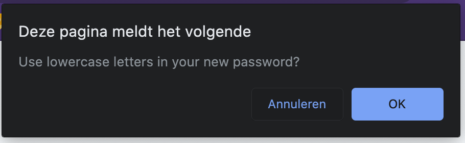

# Password Generator

## Description
This JavaScript application builds a random and secure password based on the user's choices of password length and whether to use uppercase letters, lowercase letters, numbers and/or special characters.

* Deployed application: [judeclark.github.io/password-generator](https://judeclark19.github.io/password-generator/)

## Usage

All of the files necessary to run this website are available in [this repository](https://github.com/judeclark19/password-generator).

## Screenshots:
#### Before the user clicks the button:

#### First prompt after user clicks the button:

#### If user input does NOT meet password length requirements: 

#### If user input DOES meet the requirements, they receive the following 4 confirms:

#### An example result given password length of 16, and "true" selected for the four prompts:

## License
MIT License

Copyright (c) 2020 Jude Clark

Permission is hereby granted, free of charge, to any person obtaining a copy
of this software and associated documentation files (the "Software"), to deal
in the Software without restriction, including without limitation the rights
to use, copy, modify, merge, publish, distribute, sublicense, and/or sell
copies of the Software, and to permit persons to whom the Software is
furnished to do so, subject to the following conditions:

The above copyright notice and this permission notice shall be included in all
copies or substantial portions of the Software.

THE SOFTWARE IS PROVIDED "AS IS", WITHOUT WARRANTY OF ANY KIND, EXPRESS OR
IMPLIED, INCLUDING BUT NOT LIMITED TO THE WARRANTIES OF MERCHANTABILITY,
FITNESS FOR A PARTICULAR PURPOSE AND NONINFRINGEMENT. IN NO EVENT SHALL THE
AUTHORS OR COPYRIGHT HOLDERS BE LIABLE FOR ANY CLAIM, DAMAGES OR OTHER
LIABILITY, WHETHER IN AN ACTION OF CONTRACT, TORT OR OTHERWISE, ARISING FROM,
OUT OF OR IN CONNECTION WITH THE SOFTWARE OR THE USE OR OTHER DEALINGS IN THE
SOFTWARE.